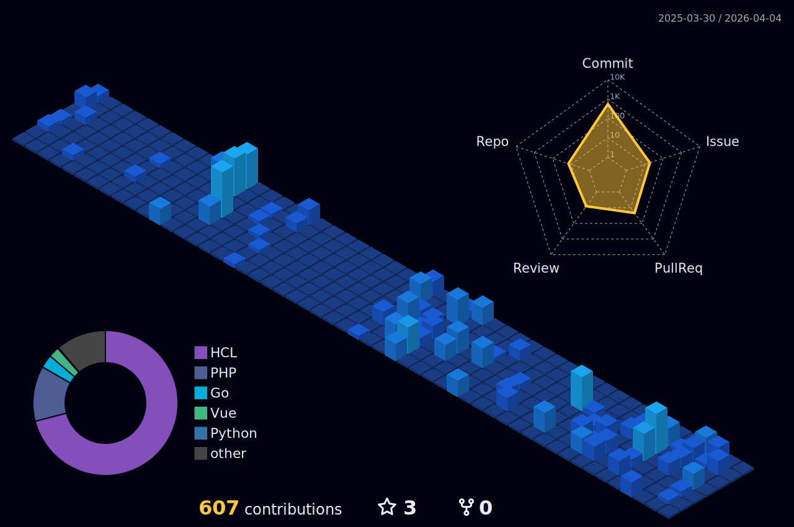

# Hi there, I'm KcivazB 👋 

## About Me 🚀

- 🔭 I'm currently working on my personal Kubernetes cluster
- 🌱 I'm diving deep into Kubernetes and Cloud Native technologies
- 💻 I'm passionate about DevOps and Infrastructure as Code
- 🛠️ Always exploring new tools and technologies in the cloud-native ecosystem

## Tech Stack 🛠️

## Current Projects 🔥

- 🎮 **Chess Engine** - A powerful chess engine implementation
- 🎵 **Concerto** - Music-related project
- 🤝 **PalBro** - Collaboration tool
- 🌐 **Portfolio** - My personal portfolio website
- ♟️ **Rookie Chess Engine** - Another chess engine implementation

  <!-- Section for the two smaller images stacked vertically -->
  

    
    
  

<!-- 
 -->
  <!-- Large 3D Contribution Graph -->
 <!--  -->
<!-- 
 -->

---

  <i>⚡ Happy coding! ⚡</i>

